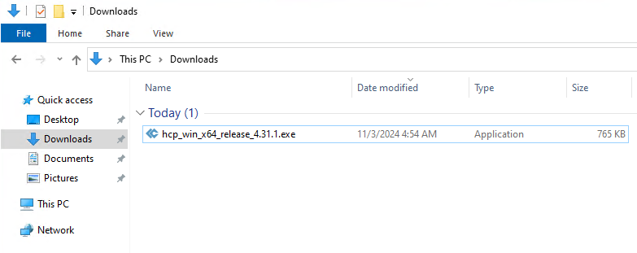
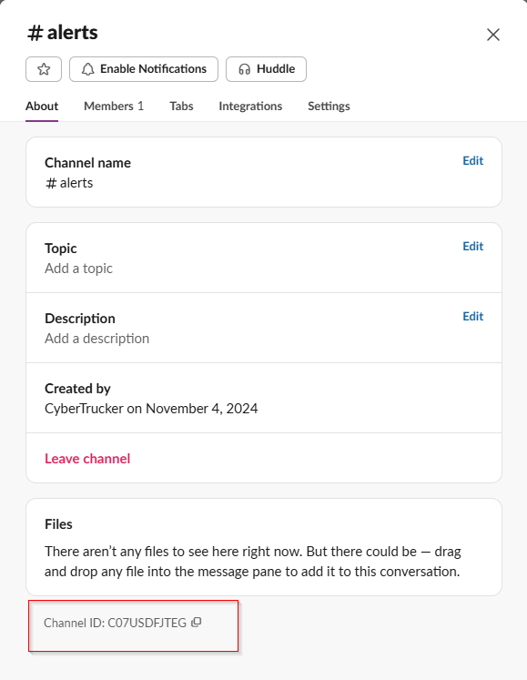
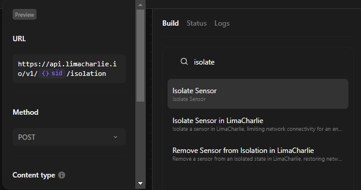

# Automated Incident Detection and Response

## Project Overview
In this lab, we will build an automated incident response workflow by integrating an **EDR (Endpoint Detection and Response)** solution, LimaCharlie, with a **SOAR (Security Orchestration, Automation, and Response)** platform, Tines. This setup will monitor for potential threats, automatically notify SOC (Security Operations Center) analysts through multiple channels, including Slack (for real-time alerts) and SquareX (for detailed email notifications), and allow users to trigger response actions, such as isolating compromised devices, in a simulated environment.

## Objectives
- Simulate a security monitoring environment and practice incident response techniques.
- Create detection and response rules within LimaCharlie.
- Build an automated workflow using Tines SOAR for faster response actions.
- Set up Slack alerts and use SquareX for email notifications containing detailed attack reports.
- Develop a SOC analyst response that can isolate compromised devices automatically.

## Prerequisites
To complete this lab, ensure you have:
- **Access to a Windows VM** (Virtual Machine) either in the cloud or on your local machine (using Hyper-V, VMware, or VirtualBox).
- Accounts on these platforms: **Tines**, **LimaCharlie**, **Slack**, and **SquareX**.

## Lab Topology

.

## Tools Overview

### SOAR (Security Orchestration, Automation, and Response)
We’ll use **Tines**, an open-source SOAR tool. Tines enables SOC teams to automate repetitive tasks, orchestrate complex workflows, and streamline incident response processes, reducing the time needed to mitigate security threats.

### EDR (Endpoint Detection and Response)
Our EDR tool for this lab is **LimaCharlie**, which continuously monitors and collects data from endpoints (e.g., computers, servers, mobile devices) to detect suspicious activities and take appropriate actions before potential breaches escalate.

### Windows VM
A **Windows Virtual Machine** will serve as our controlled test environment for simulated attacks.

### Slack
Slack will be used as a messaging platform for real-time alerts and notifications to the SOC team.

### SquareX
SquareX, a disposable email service, will be used for sending detailed email notifications to the SOC team regarding detected threats.

## Setting Up LimaCharlie on a Windows VM

### Step 1: Deploy a Windows VM
Start by deploying a **Windows VM**. You can set it up:
- On-premises on your host computer using **Hyper-V**, **VMware**, or **VirtualBox**.
- In the cloud using providers like **Azure**, **AWS**, **Vultr**, **GCP**, or **DigitalOcean**.

### Step 2: Sign Up with LimaCharlie
1. Go to the [LimaCharlie website](https://www.limacharlie.io/) and sign up for a free account.
2. Once your account is created, log in to the LimaCharlie portal.

### Step 3: Generate Installation Key in LimaCharlie
1. In the LimaCharlie portal, navigate to the **Sensors** tab.
2. Select **Installation Keys** and click on **Create Installation Key**.
3. For the description, enter a name like “SOAR-EDR-Project” to identify this key.
4. Once created, the new key will appear under **Installation Keys**.

This **Installation Key** will be required to install the LimaCharlie agent on your Windows VM.

.

.

### Step 4: Install the LimaCharlie Agent on the Windows VM
1. Connect to your Windows VM.
2. Download the **LimaCharlie Windows Agent** (64-bit) using the [download link](https://downloads.limacharlie.io/sensor/windows/64) provided in the **Installation Keys** tab in the LimaCharlie portal.
3. Copy the **Sensor Key** created in Step 3, as we’ll need it to complete the installation.

.

### Installing the Agent
1. Open an admin PowerShell terminal in the directory where the agent file is downloaded.
2. Run the following command to install the agent, replacing `lc_sensor.exe` with the downloaded file name and `YOUR_INSTALLATION_KEY` with your actual Sensor Key:
   ```powershell
   .\lc_sensor.exe -i YOUR_INSTALLATION_KEY
   ```

.

.

.

3. After installation, go to **Services** in the Windows VM, and you should see that the **LimaCharlie agent** is running.

.

### Step 5: Verify the Sensor in LimaCharlie
1. Go back to the LimaCharlie portal, and under the **Sensors** tab, navigate to the **Sensors List**.
2. You should see your Windows VM listed here. Click on it to view additional details.

.

### Exploring the Endpoint
- **File System**: View, download, and check file hashes (useful for identifying malware via VirusTotal).
- **Autorun**: Check for persistent startup items that may indicate malware.
- **Drivers**: Review drivers installed on the VM to detect any suspicious activity.
- **Console**: Send commands directly to the endpoint.
- **Network**: Monitor network processes and detect connections to any malicious IPs.
- **Timeline**: Track events in chronological order for incident analysis.

.

.

.

## Install Credential Dump Tool LaZagne

### Step 1: Preparing the Windows Server VM
1. **Disable Windows Defender:** First, disable Windows Defender on your Windows Server VM. This will allow us to download and run LaZagne without it being blocked.
2. **Download LaZagne:** Go to the official GitHub repository for LaZagne: [GitHub - AlessandroZ/LaZagne](https://github.com/AlessandroZ/LaZagne). You might see a warning about the download’s safety—ignore this by clicking on the three dots and selecting **Keep Anyway**.

.

.

### Step 2: Running LaZagne and Checking Telemetry in LimaCharlie
1. **Run LaZagne:** Execute the LaZagne tool in a admin PowerShell terminal on your VM to initiate the credential-stealing simulation.
2. **Check telemetry in LimaCharlie:** Go to LimaCharlie, go to the **Timeline** tab, and search for “LaZagne.” In the first `New_Process` event, we’ll see details like:
   - **Parent Process** (e.g., PowerShell)
   - **File Path**
   - **Process ID and Parent Process ID**
   - **Command Line**
   - **Hash**
   - **User Name**

.

### Step 3: Create a Detection & Response (D&R) Rule in LimaCharlie

Now, we’ll create a custom rule in LimaCharlie to detect LaZagne’s activity.

1. **Navigate to Automation**:
   - Go to the **Automation** tab in LimaCharlie.

2. **Create a Custom Rule**:
   - Under **D&R Rules**, click on **Create Custom Rule**.

.

3. **Use an Existing Template**:
   - To simplify rule creation, find an existing rule that detects process creation and copy it as a template.
   - Click on the link to view the rule in github.
   - Copy the rule into a text editor.
   - Modify it to detect LaZagne HackTool.

.

Here is an example of a D&R rule:

.

.

Here is the modified version:

```yaml
detect:
  events:
    - NEW_PROCESS
    - EXISTING_PROCESS
  op: and
  rules:
    - op: is windows
    - op: or
      rules:
        - case sensitive: false
          op: ends with
          path: event/FILE_PATH
          value: LaZagne.exe
        - case sensitive: false
          op: contains
          path: event/COMMAND_LINE
          value: LaZagne
        - case sensitive: false
          op: is
          path: event/HASH
          value: '3cc5ee93a9ba1fc57389705283b760c8bd61f35e9398bbfa3210e2becf6d4b05'
respond:
  - action: report
    metadata:
      author: SocLab
      description: Detects LaZagne Usage
      falsepositives:
        - None expected
      level: high
      tags:
        - attack.credential_access
    name: SocLab - HackingTool - LaZagne
```

.

### Rule Breakdown:
- **Event Types**: Triggers on **NEW_PROCESS** or **EXISTING_PROCESS**.
- **Operating System**: Targets **Windows** systems.
- **Detection Parameters**:
  - Checks if the **FILE_PATH** ends with `LaZagne.exe`.
  - Looks for "LaZagne" in the **COMMAND_LINE**.
  - Matches the **HASH** of the LaZagne executable.

### Implementing the Custom Detection Rule:
1. Copy this modified rule into your new custom rule in LimaCharlie.
2. Paste an example event of LaZagne to test if your rule correctly detects LaZagne.

.

.

### Step 4: Clear Detections and Run LaZagne Again
1. **Delete Existing Detections:** For a clean slate, delete previous detections in the **Detections** tab.
2. **Re-run LaZagne with `all` Argument:** On your Windows VM, run `lazagne.exe all` and check LimaCharlie’s **Detections** tab again to confirm your rule has detected it.

.

### Bonus Step: Detecting Mimikatz
1. **Download Mimikatz:** Get Mimikatz from [GitHub - gentilkiwi/mimikatz](https://github.com/gentilkiwi/mimikatz), extract the file, and open PowerShell as admin.
2. **Run Commands:**
   ```powershell
   privilege::debug
   sekurlsa::logonpasswords
   ```

.

3. **Check LimaCharlie Detections:** Mimikatz should trigger the built-in detection rules in LimaCharlie designed for Mimikatz.

.

## Signing Up for Slack, SquareX, and Tines

### Adding Webhook App

1. **Add the Webhook App**:
    - In your Tines story/playbook, drag and drop the **Webhook** app into the middle of your playbook.
    - Rename it to **Detection LimaCharlie**.
    - Copy the URL from the Webhook app to connect with LimaCharlie.

.

2. **Configure LimaCharlie Output**:
    - In the LimaCharlie portal, navigate to the **Outputs** tab. 
    - Click on **+ Add Output**, then select **Detections**.
    - Scroll down and choose **Tines** as the output type.
    - Give it a name and paste the URL copied from the Webhook app in Tines. Click **Save Output**.

.

.

.

.

3. **Test the Configuration**:
    - On your Windows VM, re-run the LaZagne tool to trigger a detection in LimaCharlie.
    - In the LimaCharlie portal, click on **Refresh Samples** to confirm the detection rule is working.

.

4. **Verify in Tines**:
    - Go back to the Tines portal, click on the **Webhook** app, and then click on **Events**. Check if the LaZagne detection rule was successfully received.

### Slack Setup

1. **Sign Up on Slack**:
   - Visit [Slack](https://slack.com) and choose the free version to sign up.
2. **Create a Channel**:
   - Once your account is set up, create a new channel named `#alert`.
   - This channel will receive the detection alerts from Tines.

.

.

### SquareX Setup

1. **Sign Up for SquareX**:
   - Visit [SquareX](https://sqrx.com) and sign up to receive emails from Tines.

### Tines Setup

1. **Sign Up on Tines**:
   - Go to [Tines](https://tines.com) and sign up.
2. **Explore the Interface**:
   - Upon signing in, you can drag and drop the necessary apps from the left into the middle of your "story" or "playbook".
3. **Clear Default Apps**:
   - Delete the two default apps in the middle to start fresh.

> **Tip:** For an eye-friendly experience, switch to dark mode.

.

.

## Running the Playbook in SOAR Tines

### Connecting Slack with Tines

1. **Add Slack to Your Playbook**:
    - In your Tines story/playbook, click on **Templates** and search for **Slack**. Drag it into the middle of your playbook.
    - On the right-hand side of the screen, choose **Send Message**.

.

.

2. **Integrate Tines with Slack**:
    - In the Slack portal, go to **Apps** and add the Tines app.
    - In Tines, navigate to **Dashboard**, click on **Your First Team**, then **Credentials**. Click on **+New**, search for Slack, and select it.
    - In the new window, click on **Use Tines' App for Slack**, then **Allow**.

.

.

.

.

.

3. **Connect Credentials**:
    - Go back to your playbook in Tines and connect the credentials with the Slack template you just created.
    - Input the **Channel ID** from the alerts channel in Slack. You can find this by going into the alerts channel, clicking on **Open Channel Details**, and copying the Channel ID at the bottom.

.

.

.

4. **Test Slack Integration**:
    - Click on the Slack template in Tines, and then click on **Test** to see if you receive the default "Hello, world!" in the alerts channel in Slack.

.

.

.

### Setting Up Email with SquareX

1. **Get Disposable Email Address**:
    - Go to the SquareX portal and copy your disposable email address.

.

2. **Add Email App to Tines**:
    - In Tines, drag and drop the **Send Email** app into the middle of your playbook.
    - Add the email address in the **Send Email** app.

.

3. **Test Email Integration**:
    - Connect the **Webhook** app with the **Send Email** app and the **Slack** app.
    - If everything is set up correctly, you should receive an email and a Slack message.

.

### Setting Up User Prompt

1. **Add User Prompt**:
    - In Tines, click on **Tools**, then **Page**, and drag it into the middle of your playbook.
    - Give it a name and click on **Edit Page**.

.

.

.

2. **Customize Detection Details**:
    - Modify the page to include detection details so the SOC Analyst can decide whether to isolate the device.
	- To find the good format for the fields, you can go in the webhook app, click on events, find the LaZagne event and click on a field to copy it.

.

- Use the following fields for event details:

    ```plaintext
    **Title**: <<detection_limacharlie.body.cat>>
    **Time**: <<detection_limacharlie.body.detect.routing.event_time>>
    **Device Name**: <<detection_limacharlie.body.detect.routing.hostname>>
    **Username**: <<detection_limacharlie.body.detect.event.USER_NAME>>
    **Source IP**: <<detection_limacharlie.body.detect.routing.ext_ip>>
    **File Path**: <<detection_limacharlie.body.detect.event.FILE_PATH>>
    **Command Line**: <<detection_limacharlie.body.detect.event.COMMAND_LINE>>
    **Process ID**: <<detection_limacharlie.body.detect.event.PROCESS_ID>>
    **Hash**: <<detection_limacharlie.body.detect.event.HASH>>
    **Alert Level**: <<detection_limacharlie.body.detect_mtd.level>>
    **Sensor ID**: <<detection_limacharlie.body.detect.routing.sid>>
    **Detection Link**: <<detection_limacharlie.body.link>>
    ```


.

3. **Add a Boolean Field (Yes or No)**:
    - Add a Boolean field for user prompt `isolate?`.

.

### Email Template Configuration

1. **Format Email in HTML**:
    - Copy the same fields from the **User Prompt** app.
    - Format the email in HTML to make it look nice:
        ```html
        <b>Title</b>: <<detection_limacharlie.body.cat>><br>
        <b>Time</b>: <<detection_limacharlie.body.detect.routing.event_time>><br>
        <b>Device Name</b>: <<detection_limacharlie.body.detect.routing.hostname>><br>
        <b>Username</b>: <<detection_limacharlie.body.detect.event.USER_NAME>><br>
        <b>Source IP</b>: <<detection_limacharlie.body.detect.routing.ext_ip>><br>
        <b>File Path</b>: <<detection_limacharlie.body.detect.event.FILE_PATH>><br>
        <b>Command Line</b>: <<detection_limacharlie.body.detect.event.COMMAND_LINE>><br>
        <b>Process ID</b>: <<detection_limacharlie.body.detect.event.PROCESS_ID>><br>
        <b>Hash</b>: <<detection_limacharlie.body.detect.event.HASH>><br>
        <b>Alert Level</b>: <<detection_limacharlie.body.detect_mtd.level>><br>
        <b>Sensor ID</b>: <<detection_limacharlie.body.detect.routing.sid>><br>
        <b>Detection Link</b>: <a href="<<detection_limacharlie.body.link>>"><<detection_limacharlie.body.link>></a>
        ```

.

2. **Add Fields in Slack App**:
    - Add the same fields in the Slack app to ensure the alert message contains all detection details:
        ```plaintext
        *Title*: <<detection_limacharlie.body.cat>>
        *Time*: <<detection_limacharlie.body.detect.routing.event_time>>
        *Device Name*: <<detection_limacharlie.body.detect.routing.hostname>>
        *Username*: <<detection_limacharlie.body.detect.event.USER_NAME>>
        *Source IP*: <<detection_limacharlie.body.detect.routing.ext_ip>>
        *File Path*: <<detection_limacharlie.body.detect.event.FILE_PATH>>
        *Command Line*: <<detection_limacharlie.body.detect.event.COMMAND_LINE>>
        *Process ID*: <<detection_limacharlie.body.detect.event.PROCESS_ID>>
        *Hash*: <<detection_limacharlie.body.detect.event.HASH>>
        *Alert Level*: <<detection_limacharlie.body.detect_mtd.level>>
        *Sensor ID*: <<detection_limacharlie.body.detect.routing.sid>>
        *Detection Link*: <<detection_limacharlie.body.link>>
        ```

.

3. **Run Tests**:
    - Click on your Webhook app, click on **Events**, and on the LaZagne event, click on **Re-emit**.
    - Ensure your email, Slack alert message, and user prompt all have the necessary details.

.

.

### Configuring Triggers: YES and NO

1. **Set Up NO Trigger**:
    - Drag the **Trigger** action into the middle of your playbook and configure it.
    - Name it **NO**.
    - Click on **Rule**, then **+ Plus**, then **Value**.
    - Click on **User_Prompt**, then **Body**, then **Isolate**, and set `is equal to` to **false**.

.

.

.

.

2. **Configure NO Trigger Slack Message**:
    - Copy the Slack app and connect it after the **NO** trigger.
    - Modify the message to:
        ```plaintext
        *The Device*: <<detection_limacharlie.body.detect.routing.isolate>> was not isolated, please investigate.
        ```

3. **Test NO Trigger**:
    - Re-emit an event from the Webhook, answer NO in the user prompt, and check your Slack alert message.

.

4. **Set Up YES Trigger**:
    - Copy the NO trigger and modify it. Change the name to **YES** and set `is equal to` to **true**.

.

5. **Configure YES Trigger to Isolate Device**:
    - Go to **Templates** and search for **LimaCharlie**.
    - Add it to your playbook and choose **Isolate Sensor**.
    - Replace `{} sid` with `<<detection_limacharlie.body.detect.routing.sid>>`.

.

.

6. **Add LimaCharlie Credentials**:
    - In Tines, go to **Dashboard**, then **Credentials**, and create a new LimaCharlie credential just like you did with `Slack`.
    - Navigate to LimaCharlie, go to **Access Management**, click on **REST API**, copy the Org JWT, and paste it into Tines LimaCharlie `Value` field.

.

.

7. **Test YES Trigger and Isolation**:
    - Re-emit another event from the Webhook.
    - Go to the User Input and click YES.

8. **Verify Isolation**:
    - In LimaCharlie, navigate to **Sensor List**, click on the Windows Server VM, and check the **Network Access** status.


9. **Rejoin Network**:
    - In LimaCharlie, click on **Rejoin Network**.


10. **Add Get Isolation Status**:
    - Drag a new LimaCharlie app from **Templates**.
    - Search for **Status** and choose **Get Isolation Status**.
    - Connect the credential you created before to the new LimaCharlie template.

11. **Test and Verify Isolation Status**:
    - Connect the first LimaCharlie template with the second one.
    - Change the **Sensor ID** to match your device.
    - Re-emit another event from the Webhook to ensure it works.

12. **Configure Isolated Slack Notification**:
    - Copy the second Slack app created under the **NO** trigger and connect it to the second LimaCharlie app.
    - Modify the message in the message box to:
        ```plaintext
        *Isolation Status:* <<isolate_sensor.status>>
        *Device Name*: <<detection_limacharlie.body.detect.routing.hostname>> has been isolated.
        ```

.

.

13. **Test Your Playbook**:
    - Re-emit an event or run LaZagne or Mimikatz again to test your playbook.
    - Verify that your playbook works as intended, allowing a SOC analyst to decide whether to isolate a device, sending emails to your SOC team, and providing alerts in your Slack messages.

.

## Conclusion:
You now have a complete playbook for isolating or not isolating a device based on SOC analyst inputs, with notifications via email and Slack. You've successfully connected Tines, LimaCharlie, Slack, and SquareX to create a workflow for detection, alerting, and response.

> Remember: The purpose of this lab is educational, focusing on detection engineering and incident response workflows. Tools like Mimikatz and LaZagne should never be used in a production environment unless you have explicit authorization.
